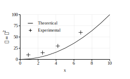
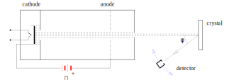

# MetaGráfica


**Español** · [English](README.md)

**Un lenguaje gráfico descriptivo para figuras técnicas y científicas de alta calidad.**

Describes *qué es la figura* —puntos, paths, structs, transformaciones— y `mg` la compila a cualquiera de los formatos **EPS**, **SVG** o **PDF** para publicaciones tradicionales o en línea. Sin necesidad de una interfaz gráfica ni ratón: una figura es código fuente, así que se versiona, se compara, se parametriza y se regenera.

Creado originalmente para publicaciones científicas como los libros de texto de Mecánica Cuántica de Ana María Cetto y Luis de la Peña *[Quantum
Mechanics: A Physical Approach](https://doi.org/10.1017/9781009679633)* (Cambridge University Press, 2025) y *[Introducción a la mecánica
cuántica](https://www.fondodeculturaeconomica.com/Ficha/9786071601766/F)* de Luis de la Peña (FCE/UNAM, 3ª ed.) y otros artículos científicos, ha evolucionado escalonadamente durante cerca de cuatro décadas.

## Inicio rápido

Nada mejor que un ejemplo para una primera impresión del lenguaje.

```matlab
display_size 9 5.5
font_size 9
world_window -2 11 -1.5 5.5

plot(x=(0,10), y=(0,100), box=(0,0, 9,4.5), grid=true) {
    line_width 0.8
    polyline { 0 0  1 1  2 4  3 9  4 16  5 25  6 36  7 49  8 64  9 81  10 100 }
    marker(size=4, shape="cross") {
        0.9 10.0
        2.5 15.0
        4.2 30.0
        6.75 60.2
    }  
    legend(at="top-left", margin=10, sample_width=20, gap=5, font_size=8) {
        entry("Theoretical") { polyline { 0 0.5  1 0.5 } }
        entry("Experimental") { marker(3, shape="cross", color="black") { 
          0.5 0.5 } }
    }
    xaxis(step=2, label="x")
    yaxis(step=25, label="$y = x^2$")
}
```

```bash
bin/mg examples/quickstart.mg quickstart.svg
```



Ese es el archivo completo ([`examples/quickstart.mg`](examples/quickstart.mg)). `plot` mapea **unidades de datos** a una caja física en centímetros; los ejes heredan los rangos `x=`/`y=` y se rotulan solos. El `$…$` del rótulo es notación matemática (subconjunto de LaTeX): MetaGráfica incrusta una fuente de TeX para letras griegas, símbolos, superíndices y subíndices.

## Ilustraciones

Es poderoso en las gráficas, pero MetaGráfica también luce en **ilustraciones** —diagramas de aparatos, esquemas, lo que un artículo necesite— y ahí es donde las estructuras, la colocación sobre arcos, las flechas y el texto matemático resaltan:



> Figura 2.5 de Ana María Cetto y Luis de la Peña, *Quantum Mechanics: A Physical
> Approach*, Cambridge University Press, 2025.
> [doi:10.1017/9781009679633](https://doi.org/10.1017/9781009679633) — reproducida aquí
> como [`examples/fig2-5.mg`](examples/fig2-5.mg), el código que la compuso.

Menos de 60 líneas de MetaGráfica: el detector es una `struct` (asociación de varios elementos gráficos) colocado a 37°, las flechas del haz y del giro del detector son marcadores que **se orientan solos** a su línea o arco —sin ángulos ni posiciones calculados a mano— y la `φ` va en Latin Modern Math.

## Texto y matemáticas

Los archivos fuente son **UTF-8**.

**Las matemáticas son Unicode de punta a punta.** Griegas, operadores, relaciones, flechas, variables en itálica y dígitos rectos viajan como codepoints y se componen con **Latin Modern Math**, que `mg` embebe en la salida: la misma tipografía que produce TeX, idéntica en los tres backends. La figura no necesita fuentes instaladas para verse en otra máquina.

**El texto corrido cubre el repertorio entero de las fuentes PostScript estándar**: latín acentuado, `¿¡ «» ° × ± µ`, y la puntuación tipográfica que esas fuentes siempre trajeron pero que Latin-1 no sabía nombrar — comillas “de imprenta” y ‘simples’, rayas de diálogo y guiones medios, puntos suspensivos, viñetas, dagas, ‰, ™, €, œ. Cada backend las resuelve en su idioma nativo: SVG emite UTF-8, PDF su propia codificación, EPS un vector de codificación propio.

**El techo es el repertorio de la fuente, no la codificación.** Otros sistemas de escritura —griego *en prosa*, cirílico, CJK, o los tonos del vietnamita— se descartan con un aviso que nombra el carácter, porque el glifo sencillamente no está en la fuente. Soportarlos implica embeber una fuente de texto Unicode, igual que se embebe Latin Modern Math para las matemáticas. El griego *matemático* funciona hoy: se escribe `$\alpha$`, no una α literal.

## Compilación

```bash
make                 # compila bin/mg y la página de manual
sudo make install    # opcional: deja mg en el PATH
```

Se requiere un compilador de C++14 (`clang++` o `g++`), `flex`, y `pandoc` para la página de manual. La biblioteca para la salida PDF, [libharu](http://libharu.org/), viene incluida en `third_party/` y no hace falta nada más que instalar.

## Uso

El formato de salida lo elige la **extensión** del archivo de salida:

```bash
bin/mg figura.mg              # → figura.eps
bin/mg figura.mg sal.svg      # → SVG
bin/mg figura.mg sal.pdf      # → PDF
```

| opción | |
|---|---|
| `-h` | ayuda |
| `-v` | versión |

## El lenguaje en un minuto

Un **punto** es una pareja de coordenadas; un **path** es una lista de puntos. Cada primitiva lleva su path entre `{ }` y su estilo entre `( )`:

```matlab
polyline { 0 0  1 2  3 1 }              % polilínea abierta
polyline(closed=true) { 0 0  1 0  1 1 } % contorno cerrado
polygon { 0 0  1 0  1 1 }               % relleno
circle(2) { 5 5  9 5 }                  % un círculo por punto
rectangle(fill="steelblue") { 0 0  4 3 }
text("masa $m_e$", align="center") { 5 1 }
```

Los **structs** son el corazón del lenguaje: puedes agrupar distintos elementos gráficos con sus atributos y colocarlos, escalarlos, girarlos y repetirlos juntos, en coordenadas homogéneas, usando solamente el nombre.

```matlab
struct Cuadro() {
	circle(0.5) { 0 0 }
    polyline(closed=true) { -1 -1  1 -1  1 1  -1 1 }
}

for i = 0 to 11 {
    Cuadro(rotate = i*7.5, scale = 1 + i*0.35)
}
```

El lenguaje completo está en [`especificacion_mg.md`](especificacion_mg.md), y `man mg` es la referencia. MetaGráfica **no** pretende ser un lenguaje de programación de
propósito general: tiene variables, expresiones, `for` e `if`, expresiones lógicas y no mucho más.

## Ejemplos

En [`examples/`](examples/) está el corpus vivo donde se pueden ver diferentes funcionalidades: todos sus archivos compilan con el binario actual y se verifican en cada cambio.

```bash
bin/mg examples/fig6-4.mg sal.svg
```

| | |
|---|---|
| `quickstart.mg` | la gráfica de arriba |
| `fig2-5.mg` | la ilustración de arriba (structs, arcos, flechas) |
| `fig6-4.mg` | eje **logarítmico**, rótulos matemáticos, anotaciones sobre los datos |
| `fig4-4.mg` | tres paneles, ejes interiores, curvas analíticas |
| `franck_condon.mg`, `turning_points.mg` | **figuras enteramente calculadas**: se dan los parámetros físicos y la geometría se deduce |
| `fig_polybar.mg` | histograma de barras con trama |
| `primitives.mg`, `fill_styles.mg`, `line_patterns.mg` | láminas de referencia |

**[Calcular en vez de medir](docs/calcular_en_vez_de_medir.md)** desarrolla ese último caso:
figuras cuya geometría sale de las fórmulas y no de medir un dibujo. Cambias un número —la
anarmonicidad de un potencial, el número de nodos de un estado— y la figura entera se
reacomoda sola, porque todo lo demás se deduce.

## Estado del proyecto

**Esta versión es aún beta**, y de ahí se siguen dos cosas. El **lenguaje todavía puede cambiar**: los nombres y los argumentos no están congelados, así que una figura que compila hoy puede necesitar un ajuste mañana (los nombres viejos fallan de forma ruidosa, nunca en silencio). Y **faltan piezas**: la especificación describe cosas que aún no existen. Lo que sí está se ejercita
con el corpus de regresión en cada cambio.

Faltan cuatro cosas para el release ([§22.7](especificacion_mg.md) lleva la lista completa), y van **en este orden**:

1. **Terminar `plot`** — `table` sigue reservado y sin construir, esperando figuras que lo pidan. (`rule` y `legend` ya están: ver [§13.8](especificacion_mg.md) y el ejemplo de arriba.)
2. **Una referencia de usuario** — hoy hay tres documentos y ninguno es el que hace falta: este README es una portada, `man mg` documenta el *binario* y no el lenguaje, y la especificación es *prospectiva* (describe cosas que aún no existen). Falta el documento que describa, completo y sin historia, **lo que hay**.
3. **Uso real por otras personas** — un periodo de figuras escritas por gente que no es el autor, con las mejoras que eso motive. **Si usas MG en esta etapa, tu opinión sobre los nombres y la ergonomía es justo lo que falta**, y todavía se puede actuar sobre ella sin costo para nadie. Va después de la referencia porque sin algo que leer, lo que se recoge es «no encontré cómo hacer X» y no «lo encontré y es incómodo», que es lo que sirve para decidir nombres.
4. **Congelar la gramática** — que una figura que compila siga compilando. Va al final a propósito: es la promesa que hace cara cualquier corrección posterior.

> **Por qué el orden importa, y no es burocracia.** Lo que compra la palabra «beta» es *el permiso para romper*: hoy renombrar algo cuesta un `sed`, y después del 1.0 cuesta una migración y un número de versión mayor. Así que congelar tiene que ser lo último. El caso real que lo demuestra ocurrió en este proyecto: `axis(title=)` significaba el *nombre del eje* y `axis(labels=)` los *números de las marcas* — los dos nombres que cualquiera alcanza primero significaban otra cosa que en el resto del mundo. Se arregló en una tarde porque no había usuarios; con veinte figuras ajenas encima, no.

*(La codificación del texto estaba en esta lista. Los archivos fuente son UTF-8 y el texto corrido cubre ya el repertorio completo de las fuentes PostScript estándar —latín acentuado más la puntuación tipográfica: comillas “de imprenta”, rayas, puntos suspensivos, viñetas, ‰, ™, €—. Las matemáticas son Unicode de punta a punta. Ver [Texto y matemáticas](#texto-y-matemáticas).)*

`mg` es el compilador de la **versión 3** (`MG_VERSION 3.0.0-beta`). La gramática antigua de dos letras (`PL`, `CR`, `GNNUM`…) —la **versión 2** de la tabla de arriba— quedó congelada en la rama `v1-legacy`, y su corpus vive en [`examples/v1/`](examples/v1/) como oráculo de migración. *(La rama y el directorio se nombraron antes de alinear la numeración con la historia editorial, y conservan el nombre viejo para no romper enlaces existentes.)* **Esos archivos no compilan con este binario.**

Cada cambio pasa por una red de regresión sobre todo el corpus (`bash test/run.sh check`): comparación byte a byte contra la salida bendecida de los tres backends, una pasada de Ghostscript sobre el EPS, y una prueba de paridad entre backends.

## Historia

MetaGráfica se ha reescrito cuatro veces, y cada versión evoluciona. Como otros lenguajes gráficos, al principio se inspiró superficialmente en MetaPost (de ahí algunas convenciones, como los comentarios `%`). Su salida puede incluirse en un documento LaTeX:

| Versión | Año | Lenguaje | Salida |
|---|---|---|---|
| **0** | 1988 | Pascal + ensamblador | primer artículo publicado |
| **1** | 1991 | C | primer libro con figuras insertadas en TeX|
| **2** | 1999–2024 | C++ / STL | solo EPS — más libros y artículos |
| **3** | 2026 | C++14 | EPS, SVG, PDF |

La versión 0 controlaba directamente una impresora láser y se escribió cuando ninguna aplicación gráfica daba la calidad que un documento científico necesitaba para publicarse. La versión 2 arrancó en 1999 con la decisión de generar Encapsulated PostScript —entonces *el* lenguaje gráfico por excelencia
para publicaciones. Su texto iba en Latin-1, con la fuente `symbol` para griegas y matemáticas; PostScript se estancó y no alcanzó la revolución de Unicode, pero sigue soportado por casi todo y se convierte a PDF sin dificultad — y resultó que sus fuentes nunca fueron la limitación que la codificación aparentaba (ver abajo).

Esta versión conserva el núcleo descriptivo y agrega los backends SVG y PDF, un modelo de coordenadas isométrico, Latin Modern Math para los símbolos, y la familia `plot` para figuras de datos. La gramática de dos letras desapareció y el lenguaje dejó de parecer lenguaje ensamblador y ahora es mucho más poderoso. Ver *Estado del proyecto*.

## Licencia

GPL 3.0 — Copyright © 1988–2026 Alejandro Aguilar Sierra (algsierra@gmail.com)

El rango abarca la vida de la obra — ver *Historia*. Texto completo en
[`LICENSE`](LICENSE).
