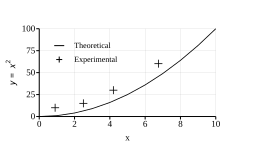
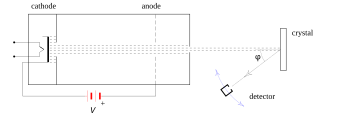
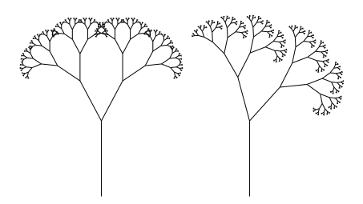
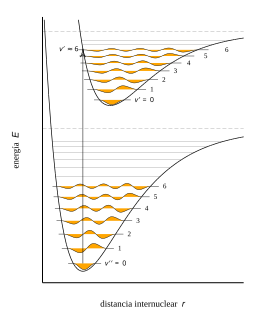
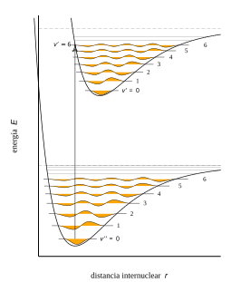
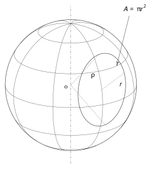

# MetaGráfica


**Español** · [English](README.md)

**Un lenguaje gráfico descriptivo para figuras técnicas y científicas de alta calidad.**

Describes *qué es la figura* —puntos, paths, structs, transformaciones— y `mg` la compila a cualquiera de los formatos **EPS**, **SVG** o **PDF** para publicaciones tradicionales o en línea. Sin necesidad de una interfaz gráfica ni ratón: una figura es código fuente, así que se versiona, se compara, se parametriza y se regenera.

Se creó para figuras de publicaciones científicas —entre ellas los libros de mecánica cuántica de Ana María Cetto y Luis de la Peña— y lleva cerca de cuatro décadas en uso.

**→ [Ver la galería](https://asierra.github.io/Metagrafica/docs/galeria.html)** — todas las
figuras de ejemplo, cada una junto al código que la dibuja.

## Inicio rápido

Nada mejor que un ejemplo para una primera impresión del lenguaje.

<!-- mg-cita: examples/quickstart.mg -->
```octave
display_size 9 5.5
font_size 9
world_window -2 11 -1.5 5.5

plot(x=(0,10), y=(0,100), box=(0,0, 9,4.5), grid=true) {
    line_width 0.8
    polyline { 0 0  1 1  2 4  3 9  4 16  5 25  6 36  7 49  8 64  9 81  10 100 }
    marker(size=4, shape="cross") {
        0.9 10.0
        2.5 15.0
        4.2 30.0
        6.75 60.2
    }
    legend(at="top-left", margin=10, sample_width=20, gap=5, font_size=8) {
        entry("Theoretical") { polyline { 0 0.5  1 0.5 } }
        entry("Experimental") { marker(3, shape="cross", color="black") {
          0.5 0.5 } }
    }
    xaxis(step=2, label="x")
    yaxis(step=25, label="$y = x^2$")
}
```

```bash
bin/mg examples/quickstart.mg quickstart.svg
```



Ese es el archivo completo ([`examples/quickstart.mg`](examples/quickstart.mg)). `plot` mapea **unidades de datos** a una caja física en centímetros; los ejes heredan los rangos `x=`/`y=` y se rotulan solos. El `$…$` del rótulo es notación matemática (subconjunto de LaTeX): MetaGráfica incrusta una fuente de TeX para letras griegas, símbolos, superíndices y subíndices.

## Ilustraciones

Es poderoso en las gráficas, pero MetaGráfica también luce en **ilustraciones** —diagramas de aparatos, esquemas, lo que un artículo necesite— y ahí es donde las estructuras, la colocación sobre arcos, las flechas y el texto matemático resaltan:



> Figura 2.5 de Ana María Cetto y Luis de la Peña, *Quantum Mechanics: A Physical
> Approach*, Cambridge University Press, 2025.
> [doi:10.1017/9781009679633](https://doi.org/10.1017/9781009679633) — reproducida aquí
> como [`examples/fig2-5.mg`](examples/fig2-5.mg), el código que la compuso.

Menos de 60 líneas de MetaGráfica: el detector es una `struct` (asociación de varios elementos gráficos) colocado a 37°, las flechas del haz y del giro del detector son marcadores que **se orientan solos** a su línea o arco —sin ángulos ni posiciones calculados a mano— y la `φ` va en Latin Modern Math.

## Recursión

Una estructura puede contenerse **a sí misma**. Los dos árboles de abajo son la misma
estructura de cuatro líneas —un tronco con dos copias menores de sí mismo en la punta—
invocada dos veces con ángulos de rama distintos; cada uno son 511 segmentos:



> Figura 4 de A. Aguilar Sierra, *Metagrafic: hacia un lenguaje para la graficación por
> computadora*, Ciencias **21**, 1991 — reconstruida como
> [`examples/fractal_tree.mg`](examples/fractal_tree.mg) a partir del listado impreso en
> su apéndice.

La condición de paro es un `if` corriente; `max_depth` es la red, y es la pieza sin la cual
1991 no podía: aquel lenguaje no tenía condicionales, así que el límite de profundidad era
lo *único* que terminaba la recursión.

## Una figura con parámetros

Versionar una figura o compararla se imagina solo. **Parametrizarla** no, y es la afirmación
del encabezado que ninguna herramienta de dibujo puede igualar: en un SVG no hay número que
cambiar. [`examples/franck_condon.mg`](examples/franck_condon.mg) dibuja dos potenciales de
Morse con sus niveles vibracionales y sus funciones de onda, y **nada en él está medido**: se
dan cinco números por estado electrónico y el resto es forma cerrada.

<!-- mg-cita: examples/franck_condon.mg -->
```octave
a1  = 1.8            % alcance del potencial
re1 = 1.15           % distancia de equilibrio
we1 = 0.56           % frecuencia vibracional
xe1 = 0.028          % anarmonicidad
D1  = we1/(4*xe1)    % profundidad — se deduce de los dos anteriores
```

Un nivel vibracional se traza entonces entre sus propios puntos de retorno, y esos dos
puntos se calculan en el mismo renglón a partir de su energía:

<!-- mg-cita: examples/franck_condon.mg -->
```octave
E  = we*(v+0.5) - we*xe*(v+0.5)*(v+0.5)
s  = sqrt(E/D)
rm = re - ln(1+s)/a
rp = re - ln(1-s)/a
```

`rm` y `rp` no son coordenadas: son la fórmula. Y son los que fijan el ancho de la onda que
se dibuja entre ellos, así que la función de onda hereda la geometría del nivel sin que nadie
la mida.

**La prueba es cambiar un número.** Las dos figuras de abajo salen del mismo archivo, con un
solo carácter de diferencia entre ellas — la anarmonicidad `xe1`, de `0.028` a `0.045`:

| `xe1 = 0.028` | `xe1 = 0.045` |
|:---:|:---:|
|  |  |

El pozo se hace menos profundo (`D` pasa de 5.0 a 3.1), la línea de disociación baja con él,
los niveles se separan y se apiñan antes, las ondas se reajustan a sus nuevos puntos de
retorno, y el número de estados ligados cae de v = 17 a v = 10, porque `vmax = 1/(2·xe) − ½`.
Nada de eso está escrito en el archivo: están escritas las **fórmulas**, y la figura es lo
que se deduce de ellas.

El detalle que mejor resume la idea es que la transición vertical de Franck-Condon —la que
le da nombre al principio— aterriza en el nivel v′≈6 del estado excitado **sin que nadie la
ponga ahí**. Sale del desplazamiento entre las dos distancias de equilibrio (`re1 = 1.15`
frente a `re2 = 1.48`). Acerca los pozos y la transición se mueve sola al nivel que le toca.

**[Calcular en vez de medir](docs/calcular_en_vez_de_medir.md)** desarrolla el caso: figuras
cuya geometría sale de las fórmulas y no de medir un dibujo.

## Texto y matemáticas

Los archivos fuente son **UTF-8**.

**Las matemáticas son Unicode de punta a punta.** Griegas, operadores, relaciones, flechas, variables en itálica y dígitos rectos viajan como codepoints y se componen con **Latin Modern Math**, que `mg` embebe en la salida: la misma tipografía que produce TeX, idéntica en los tres backends. La figura no necesita fuentes instaladas para verse en otra máquina.

**El texto corrido cubre el repertorio entero de las fuentes PostScript estándar**: latín acentuado, `¿¡ «» ° × ± µ`, y la puntuación tipográfica que esas fuentes siempre trajeron pero que Latin-1 no sabía nombrar — comillas “de imprenta” y ‘simples’, rayas de diálogo y guiones medios, puntos suspensivos, viñetas, dagas, ‰, ™, €, œ. Cada backend las resuelve en su idioma nativo: SVG emite UTF-8, PDF su propia codificación, EPS un vector de codificación propio.

**El techo es el repertorio de la fuente, no la codificación.** Otros sistemas de escritura —griego *en prosa*, cirílico, CJK, o los tonos del vietnamita— se descartan con un aviso que nombra el carácter, porque el glifo sencillamente no está en la fuente. Soportarlos implica embeber una fuente de texto Unicode, igual que se embebe Latin Modern Math para las matemáticas. El griego *matemático* funciona hoy: se escribe `$\alpha$`, no una α literal.

## Escenas pseudo-3D

Se describe el **espacio**, no la proyección. `view3d` fija la cámara una vez para toda la
figura, `plane3d` convierte el dibujo 2-D corriente en dibujo *sobre un plano de la escena*, y
`xyz()` coloca un punto que no pertenece a ningún plano.

```octave
view3d(azimuth=35, elevation=25)

plane3d(u=[1, 0, 0], v=[0, 0, 1]) {
    circle(1) { 0 0 }        % sale como la elipse exacta de su proyección
}
polyline(dash="dotted") { xyz(0,0,0)  xyz(0,1.5,0) }
```



Cada meridiano, cada paralelo y el borde del casquete de arriba es un **círculo del espacio**, y
no se calcula ni un semieje: un `circle` dibujado dentro de un `plane3d` se proyecta solo a la
elipse que le toca. Ahí dentro sigue funcionando todo el lenguaje 2-D —`sine`, rellenos,
marcadores, arcos, texto—, así que una onda sobre un plano es simplemente un `sine`
([`onda_electromagnetica.mg`](examples/onda_electromagnetica.mg)).

Es **pseudo**-3D a propósito: no hay motor de superficies ocultas ni modelo de iluminación. Qué
va delante de qué se decide en el fuente, en forma cerrada, que es lo que suele querer una
figura de libro — [`irradiancia.mg`](examples/irradiancia.mg) calcula la silueta de un cono como
las tangentes desde un punto al borde de un disco, y
[`seccion_eficaz.mg`](examples/seccion_eficaz.mg) arma sus sólidos de revolución con
[`lib/pseudo3d.mg`](lib/pseudo3d.mg). Cambiar `azimuth` o `elevation` mueve la figura entera
junta. El detalle está en [§13 de la referencia](docs/referencia.md).

## El lenguaje en un minuto

Un **punto** es una pareja de coordenadas; un **path** es una lista de puntos. Cada primitiva lleva su path entre `{ }` y su estilo entre `( )`:

```octave
polyline { 0 0  1 2  3 1 }              % polilínea abierta
polyline(closed=true) { 0 0  1 0  1 1 } % contorno cerrado
polygon { 0 0  1 0  1 1 }               % relleno
circle(2) { 5 5  9 5 }                  % un círculo por punto
rectangle(fill="steelblue") { 0 0  4 3 }
text("masa $m_e$", align="center") { 5 1 }
```

Los **structs** son el corazón del lenguaje: puedes agrupar distintos elementos gráficos con sus atributos y colocarlos, escalarlos, girarlos y repetirlos juntos, en coordenadas homogéneas, usando solamente el nombre.

```octave
struct Cuadro() {
	circle(0.5) { 0 0 }
    polyline(closed=true) { -1 -1  1 -1  1 1  -1 1 }
}

for i = 0 to 11 {
    Cuadro(rotate = i*7.5, scale = 1 + i*0.35)
}
```

La referencia del lenguaje es **[`docs/referencia.md`](docs/referencia.md)** — se lee de corrido o se consulta mientras construyes una figura. `man mg` es la versión de terminal, y la especificación de diseño exhaustiva (interna) es [`especificacion_mg.md`](especificacion_mg.md). MetaGráfica **no** pretende ser un lenguaje de programación de
propósito general: tiene variables, expresiones, `for` e `if`, expresiones lógicas y no mucho más.

## ¿Por qué no TikZ o matplotlib?

Porque contestan preguntas distintas, y conviene ser claro sobre la que MG **no** contesta.

**matplotlib**, gnuplot o NCL parten de los *datos*: tienes un arreglo y quieres verlo. MG no
analiza datos (`polybar` recibe intervalos ya contados, no observaciones), no tiene
estadística ni interactividad. Si tu figura es una vista de un conjunto de datos, usa esos.

**TikZ** es el vecino de verdad: también declarativo, también figura-como-código, mismo
público. Además ya está instalado en cualquier sistema TeX y tiene una década de paquetes que
MG nunca va a tener. Lo que MG ofrece a cambio es que no arrastra LaTeX —el corpus completo,
24 figuras, compila en **90 ms**—, que un mismo fuente produce EPS, SVG *y* PDF, y que una
figura es un documento autónomo y no un fragmento de un artículo.

MG es para el tercer caso: **sabes exactamente cómo tiene que ser la figura, y la necesitas
precisa, reproducible y parametrizada.** Una ilustración de libro de texto, un diagrama de
aparato, una curva que se deduce de una fórmula en vez de medirse en pantalla.

## Compilación

```bash
make                 # compila bin/mg y la página de manual
sudo make install    # opcional: deja mg en el PATH
```

### Windows

Lo más fácil es no compilar: cada release trae un **`mg.exe`** en
[Releases](https://github.com/asierra/Metagrafica/releases). Se descomprime donde sea y
corre — sin instalador y sin DLLs; lo único es que `lib/` quede junto al ejecutable, que es
donde el binario busca la biblioteca de `include`.

Para compilarlo tú mismo, se cruza desde Linux con MinGW-w64, que es como se armó también la
versión de 1999:

```bash
sudo apt install mingw-w64 libz-mingw-w64-dev
make CROSS=x86_64-w64-mingw32          # → bin/mg.exe, enlazado estático
```

Se requiere un compilador de C++14 (`clang++` o `g++`), GNU `make` y **zlib**. La biblioteca para la salida PDF, [libharu](http://libharu.org/), viene incluida en `third_party/`. Otras dos herramientas son opcionales: `flex`, que solo hace falta si modificas el lexer (el generado está en el repositorio), y `pandoc`, solo para la página de manual — sin él `make` compila el binario igual y lo avisa.

## Uso

El formato de salida lo elige la **extensión** del archivo de salida:

```bash
bin/mg figura.mg              # → figura.eps
bin/mg figura.mg sal.svg      # → SVG
bin/mg figura.mg sal.pdf      # → PDF
```

| opción | |
|---|---|
| `-h` | ayuda |
| `-v` | versión |

## Ejemplos

La **[galería](https://asierra.github.io/Metagrafica/docs/galeria.html)** los muestra a
todos renderizados, con su código.

En [`examples/`](examples/) está el corpus vivo donde se pueden ver diferentes funcionalidades: todos sus archivos compilan con el binario actual y se verifican en cada cambio.

```bash
bin/mg examples/fig6-4.mg sal.svg
```

| | |
|---|---|
| `quickstart.mg` | la gráfica de arriba |
| `fig2-5.mg` | la ilustración de arriba (structs, arcos, flechas) |
| `fig6-4.mg` | eje **logarítmico**, rótulos matemáticos, anotaciones sobre los datos |
| `fig4-4.mg` | tres paneles, ejes interiores, curvas analíticas |
| `franck_condon.mg`, `turning_points.mg` | **figuras enteramente calculadas**: se dan los parámetros físicos y la geometría se deduce |
| `fig_polybar.mg` | histograma de barras con trama |
| `fractal_tree.mg` | **recursión**: una estructura que se contiene a sí misma |
| `angulo_solido.mg`, `onda_electromagnetica.mg` | **pseudo-3D**: `view3d`, `plane3d`, `xyz()` |
| `irradiancia.mg`, `seccion_eficaz.mg` | pseudo-3D con **siluetas calculadas** y sólidos de revolución |
| `espectro.mg` | rellenos **degradados** |
| `primitives.mg`, `fill_styles.mg`, `line_patterns.mg` | láminas de referencia |

## Escribir figuras con un asistente

Si usas un agente de código, [`skills/figuras-mg/`](skills/figuras-mg/) es el contexto que hay
que darle: las reglas duras del lenguaje —cada una un error **medido**, no una precaución— y la
lista de comprobación para el paso que ningún compilador hace, decidir si la figura está de
verdad bien.

Si instalaste con `make install`, **enlázalo en vez de copiarlo** — una copia se queda atrás sin
que nada avise, y así se actualiza sola con cada instalación:

```bash
mkdir -p ~/.claude/skills
ln -sfn /usr/local/share/metagrafica/skills/figuras-mg ~/.claude/skills/figuras-mg
```

A nivel de usuario queda disponible en cualquier proyecto, y **fuera de cualquier carpeta que
sincronices** — un enlace dentro de Dropbox o similar suele acabar convertido en copia. Si usas
el paquete del release sin instalar, copia `skills/figuras-mg/` al `.claude/skills/` de tu
proyecto, sabiendo que eso es una foto fija de esa versión.

⚠️ **Apúntalo a la referencia instalada, no la copies a tu proyecto** — una copia se pudre sin
que nada avise. Los bloques de código del propio skill los compila la red de pruebas en cada
cambio, así que no puede alejarse en silencio del lenguaje mientras la gramática siga en beta.

Si quieres trabajar en el compilador, [`CONTRIBUTING.md`](CONTRIBUTING.md) tiene las reglas
y las compuertas de prueba.

## Estado del proyecto

**Esta versión es aún beta** (`MG_VERSION 3.1.0-beta`). Esto tiene dos implicaciones directas para los usuarios:

1. **El lenguaje todavía puede cambiar.** Los nombres de los comandos y de sus argumentos no están congelados, así que una figura que compila hoy puede necesitar un ajuste menor más adelante; los nombres viejos fallan de forma ruidosa, nunca en silencio. Cada cambio pasa por una red de regresión sobre todo el corpus: «beta» no quiere decir que la salida se mueva sola, quiere decir que un nombre puede cambiar — y siempre avisando.

2. **Buscamos tu retroalimentación.** Antes de congelar la gramática hace falta validar la herramienta con uso real. **Si usas MG en esta etapa, tu opinión sobre la ergonomía y los nombres es justo lo que falta**, y todavía estamos a tiempo de cambiar sin costo para nadie — que es exactamente para lo que sirve la etiqueta «beta». El lugar es [el gestor de issues](https://github.com/asierra/Metagrafica/issues): un «no encontré cómo hacer X» sirve tanto como un error, y a menudo más.

La lista completa de lo que falta para el 1.0 está en [§22.7 de la especificación](especificacion_mg.md).

## Historia

Creado originalmente para publicaciones científicas como los libros de texto de Mecánica Cuántica de Ana María Cetto y Luis de la Peña *[Quantum
Mechanics: A Physical Approach](https://doi.org/10.1017/9781009679633)* (Cambridge University Press, 2025) y *[Introducción a la mecánica
cuántica](https://www.fondodeculturaeconomica.com/Ficha/9786071601766/F)* de Luis de la Peña (FCE/UNAM, 3ª ed.) y otros artículos científicos, ha evolucionado escalonadamente durante cerca de cuatro décadas.
Como otros lenguajes gráficos, al principio se inspiró superficialmente en MetaPost (de ahí algunas convenciones, como los comentarios `%`). Su salida puede incluirse en un documento LaTeX:

| Versión | Año | Lenguaje | Salida |
|---|---|---|---|
| **0** | 1988 | Pascal + ensamblador | primer artículo publicado |
| **1** | 1991 | C | primer libro con figuras insertadas en TeX|
| **2** | 1999–2024 | C++ / STL | solo EPS — más libros y artículos |
| **3** | 2026 | C++14 | EPS, SVG, PDF |

La versión 0 controlaba directamente una impresora láser y se escribió cuando ninguna aplicación gráfica daba la calidad que un documento científico necesitaba para publicarse. La versión 2 arrancó en 1999 con la decisión de generar Encapsulated PostScript —entonces *el* lenguaje gráfico por excelencia
para publicaciones. Su texto iba en Latin-1, con la fuente `symbol` para griegas y matemáticas; PostScript se estancó y no alcanzó la revolución de Unicode, pero sigue soportado por casi todo y se convierte a PDF sin dificultad — y resultó que sus fuentes nunca fueron la limitación que la codificación aparentaba (ver abajo).

Esta versión conserva el núcleo descriptivo y agrega los backends SVG y PDF, un modelo de coordenadas isométrico, Latin Modern Math para los símbolos, y la familia `plot` para figuras de datos. La gramática de dos letras desapareció y el lenguaje dejó de parecer lenguaje ensamblador y ahora es mucho más poderoso. Ver *Estado del proyecto*.

## Licencia

GPL 3.0 — Copyright © 1988–2026 Alejandro Aguilar Sierra (algsierra@gmail.com)

El rango abarca la vida de la obra — ver *Historia*. Texto completo en
[`LICENSE`](LICENSE).
