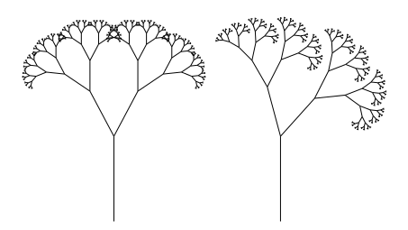
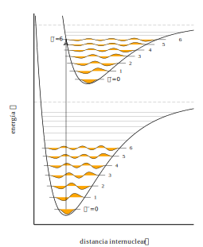
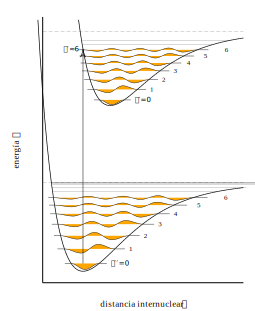

# MetaGráfica


**English** · [Español](README.es.md)

**A descriptive graphics language for high-quality technical and scientific figures.**

You describe *what the figure is* — points, paths, structures, transformations — and
`mg` compiles it to any of **EPS**, **SVG** or **PDF**, for print or online publishing.
No GUI, no mouse needed: a figure is source code, so it can be versioned, diffed,
parameterized and regenerated.

It was created for the figures of scientific publications — among them Ana María Cetto and
Luis de la Peña's quantum mechanics textbooks — and has been in use for nearly four decades.

**→ [See the gallery](https://asierra.github.io/Metagrafica/docs/galeria.html)** — the 21
example figures, each one next to the source that draws it.

## Quick start

Nothing beats an example for a first impression of the language.

```octave
display_size 9 5.5
font_size 9
world_window -2 11 -1.5 5.5

plot(x=(0,10), y=(0,100), box=(0,0, 9,4.5), grid=true) {
    line_width 0.8
    polyline { 0 0  1 1  2 4  3 9  4 16  5 25  6 36  7 49  8 64  9 81  10 100 }
    marker(size=4, shape="cross") {
        0.9 10.0
        2.5 15.0
        4.2 30.0
        6.75 60.2
    }
    legend(at="top-left", margin=10, sample_width=20, gap=5, font_size=8) {
        entry("Theoretical") { polyline { 0 0.5  1 0.5 } }
        entry("Experimental") { marker(3, shape="cross", color="black") { 0.5 0.5 } }
    }
    xaxis(step=2, label="x")
    yaxis(step=25, label="$y = x^2$")
}
```

```bash
bin/mg examples/quickstart.mg quickstart.svg
```


That is the whole file ([`examples/quickstart.mg`](examples/quickstart.mg)). `plot` maps
**data units** onto a physical box in centimetres; the axes inherit the `x=`/`y=` ranges
and label themselves. The `$…$` in the axis label is math markup (a LaTeX subset) —
MetaGráfica embeds a TeX font for Greek letters, symbols, superscripts and subscripts.

## Illustrations

It shines at plots, but MetaGráfica is just as capable at **illustrations** — apparatus
diagrams, sketches, anything a paper needs — and that is where structures, placement
along arcs, arrows and math labels stand out:


> Figure 2.5 of Ana María Cetto & Luis de la Peña, *Quantum Mechanics: A Physical
> Approach*, Cambridge University Press, 2025.
> [doi:10.1017/9781009679633](https://doi.org/10.1017/9781009679633) — reproduced here
> as [`examples/fig2-5.mg`](examples/fig2-5.mg), the source that typeset it.

Under 60 lines of MetaGráfica: the detector is a `struct` (a grouping of several graphics
elements) placed at 37°, the beam and detector-swing arrows are markers that **orient
themselves** to their line or arc — no angles or positions worked out by hand — and `φ`
is set in Latin Modern Math.

## Recursion

A structure can contain **itself**. Both trees below are the same four-line structure —a
trunk with two smaller copies of itself at its tip— invoked twice with different branch
angles; each is 511 segments:



> Figure 4 of A. Aguilar Sierra, *Metagrafic: hacia un lenguaje para la graficación por
> computadora*, Ciencias **21**, 1991 — reconstructed as
> [`examples/fractal_tree.mg`](examples/fractal_tree.mg) from the listing printed in its
> appendix.

The stop condition is an ordinary `if`; `max_depth` is the safety net, and it is the one
piece that 1991 could not do without — that language had no conditionals, so the depth
limit was the *only* thing that ended the recursion.

## A figure with parameters

Versioning a figure or diffing it is easy to picture. **Parameterizing** one is not, and it
is the claim at the top of this page that no drawing tool can match — in an SVG there is no
number to change. [`examples/franck_condon.mg`](examples/franck_condon.mg) draws two Morse
potentials with their vibrational levels and their wave functions, and **nothing in it is
measured**: you give five numbers per electronic state and the rest is closed form.

```octave
a1  = 1.8            % range of the potential
re1 = 1.15           % equilibrium distance
we1 = 0.56           % vibrational frequency
xe1 = 0.028          % anharmonicity
D1  = we1/(4*xe1)    % depth — follows from the two above
```

A vibrational level is then drawn between its own turning points, worked out on the same
line from its energy:

```octave
E = we1*(v+0.5) - we1*xe1*(v+0.5)*(v+0.5)
s = sqrt(E/D1)
polyline { (re1 - ln(1+s)/a1)  (E)   (re1 - ln(1-s)/a1)  (E) }
```

Its endpoints are not coordinates; they are the formula.

**The proof is changing one number.** Both figures below come from the same file, with a
single character different between them — the anharmonicity `xe1`, from `0.028` to `0.045`:

| `xe1 = 0.028` | `xe1 = 0.045` |
|:---:|:---:|
|  |  |

The well gets shallower (`D` goes from 5.0 to 3.1), the dissociation line drops with it, the
levels spread out and crowd together sooner, the waves readjust to their new turning points,
and the number of bound states falls from v = 17 to v = 10, because `vmax = 1/(2·xe) − ½`.
None of that is written in the file: the **formulas** are, and the figure is what follows
from them.

The detail that best sums it up is that the vertical Franck-Condon transition —the one the
principle is named after— lands on level v′≈6 of the excited state **without anyone putting
it there**. It comes out of the offset between the two equilibrium distances (`re1 = 1.15`
against `re2 = 1.48`). Move the wells closer and the transition shifts by itself to the
level it belongs on.

**[Computing instead of measuring](docs/computing_instead_of_measuring.md)** develops the
case: figures whose geometry comes out of the formulas rather than out of measuring a
drawing.

## Text and mathematics

Source files are **UTF-8**.

**Mathematics is Unicode from end to end.** Greek, operators, relations, arrows, italic
variables and upright digits all travel as codepoints and are set in **Latin Modern
Math**, which `mg` embeds in the output — the same typeface TeX produces, and identical
across the three backends. A figure needs no fonts installed to render elsewhere.

**Running text covers the whole repertoire of the standard PostScript fonts**: accented
Latin, `¿¡ «» ° × ± µ`, and the typographic punctuation those fonts have always carried
but that Latin-1 could not name — “curly quotes”, ‘single’ ones, en and em dashes,
ellipses, bullets, daggers, ‰, ™, €, œ. Each backend resolves them natively: SVG emits
UTF-8, PDF its own encoding, EPS a custom encoding vector.

**The ceiling is the font's repertoire, not the encoding.** Other writing systems —
Greek *prose*, Cyrillic, CJK, or Vietnamese tone marks — are dropped with a warning that
names the character, because the glyph simply is not in the font. Supporting them means
embedding a Unicode text font, the way Latin Modern Math is embedded for mathematics.
Greek in *mathematics* works today: write `$\alpha$`, not a literal α.

## The language in one minute

A **point** is a pair of coordinates; a **path** is a list of points. Every primitive
takes a path in `{ }` and its style in `( )`:

```octave
polyline { 0 0  1 2  3 1 }              % open polyline
polyline(closed=true) { 0 0  1 0  1 1 } % closed outline
polygon { 0 0  1 0  1 1 }               % filled
circle(2) { 5 5  9 5 }                  % one circle per point
rectangle(fill="steelblue") { 0 0  4 3 }
text("mass $m_e$", align="center") { 5 1 }
```

**Structures** are the heart of the language: you can group different graphics elements
together with their attributes and place, scale, rotate and repeat them as a unit, in
homogeneous coordinates, using just their name.

```octave
struct Square() {
	circle(0.5) { 0 0 }
    polyline(closed=true) { -1 -1  1 -1  1 1  -1 1 }
}

for i = 0 to 11 {
    Square(rotate = i*7.5, scale = 1 + i*0.35)
}
```

The full language is specified in [`especificacion_mg.md`](especificacion_mg.md) *(in
Spanish)*; `man mg` is the reference in English. MetaGráfica is deliberately **not** a
general-purpose programming language: it has variables, expressions, `for` and `if`,
logical expressions, and not much more.

## Building

```bash
make                 # builds bin/mg and the man page
sudo make install    # optional: puts mg on your PATH
```

Requires a C++14 compiler (`clang++` or `g++`), GNU `make`, and **zlib**. The library for
PDF output, [libharu](http://libharu.org/), is vendored in `third_party/`. Two more tools
are optional: `flex`, needed only if you modify the lexer (the generated one is in the
repository), and `pandoc`, only for the man page — without it `make` still builds the
binary and says so.

## Usage

The output format is chosen by the **extension** of the output file:

```bash
bin/mg figure.mg              # → figure.eps
bin/mg figure.mg out.svg      # → SVG
bin/mg figure.mg out.pdf      # → PDF
```

| flag | |
|---|---|
| `-h` | help |
| `-v` | version |

## Examples

The **[gallery](https://asierra.github.io/Metagrafica/docs/galeria.html)** shows every one
of them rendered, with its source.

[`examples/`](examples/) holds the working corpus, where you can see the different
features in action — every file there compiles with the current binary and is checked on
every change:

```bash
bin/mg examples/fig6-4.mg out.svg
```

| | |
|---|---|
| `quickstart.mg` | the figure above |
| `fig2-5.mg` | the illustration above (structures, arcs, arrows) |
| `fig6-4.mg` | **log** axis, math labels, data annotations |
| `fig4-4.mg` | three panels, interior axes, analytic curves |
| `franck_condon.mg`, `turning_points.mg` | **fully computed figures**: you give the physical parameters and the geometry follows |
| `fig_polybar.mg` | bar histogram with hatching |
| `fractal_tree.mg` | **recursion**: a structure that contains itself |
| `primitives.mg`, `fill_styles.mg`, `line_patterns.mg` | reference sheets |

If you want to work on the compiler itself, [`CONTRIBUTING.md`](CONTRIBUTING.md) has the
rules and the test gates.

## Project status

**This version is still beta** (`MG_VERSION 3.0.0-beta`). Two things follow from that,
and both matter to you directly:

1. **The language can still change.** The names of commands and of their arguments are not
   frozen, so a figure that compiles today may need a small edit later on; the old names
   fail loudly, never silently. Every change is gated by a regression harness over the
   whole corpus: "beta" does not mean the output drifts on its own, it means a name may
   change — and always with a warning.

2. **We are looking for your feedback.** Before the grammar is frozen, the tool needs to be
   validated by real use. **If you use MG at this stage, your opinion on the ergonomics and
   the names is exactly what is missing**, and there is still time to change things at no
   cost to anyone — which is precisely what the "beta" label is for.

The full list of what is left for 1.0 is in [§22.7 of the specification](especificacion_mg.md).

## History

Originally created for scientific publications such as Ana María Cetto and Luis de la
Peña's quantum mechanics textbooks, *[Quantum Mechanics: A Physical
Approach](https://doi.org/10.1017/9781009679633)* (Cambridge University Press, 2025) and
*[Introducción a la mecánica
cuántica](https://www.fondodeculturaeconomica.com/Ficha/9786071601766/F)* by Luis de la
Peña (FCE/UNAM, 3rd ed.), and other scientific papers, it has evolved in stages over
nearly four decades.
Like other graphics languages, it was initially loosely inspired by MetaPost (hence some
conventions, like `%` comments). Its output can be embedded in a LaTeX document:

| Version | Year | Language | Output |
|---|---|---|---|
| **0** | 1988 | Pascal + assembler | first published paper |
| **1** | 1991 | C | first book, with figures embedded in TeX |
| **2** | 1999–2024 | C++ / STL | EPS only — more books and papers |
| **3** | 2026 | C++14 | EPS, SVG, PDF |

Version 0 drove a laser printer directly and was written when no graphics application
produced output of the quality a scientific paper needed. Version 2 began in 1999 with
the decision to emit Encapsulated PostScript — then *the* graphics language for
publishing. Its text was Latin-1, with the standard `symbol` font for Greek and
mathematics. PostScript stagnated and never caught the Unicode revolution, but it is
still widely supported and converts trivially to PDF — and, as it turns out, its fonts
were never the limitation the encoding made them look (see below).

This version keeps the descriptive core and adds the SVG and PDF backends, an isometric
coordinate model, Latin Modern Math for symbols, and the `plot` family for data figures.
The two-letter grammar is gone and the language stopped resembling assembly and is now
much more powerful. See *Project status*.

## License

GPL 3.0 — Copyright © 1988–2026 Alejandro Aguilar Sierra (algsierra@gmail.com)

The range spans the life of the work — see *History* above. Full text in
[`LICENSE`](LICENSE).
