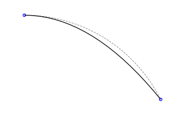
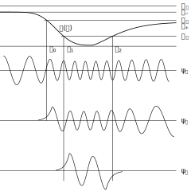
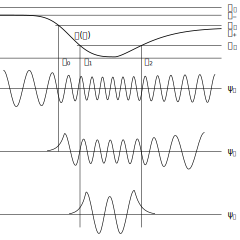
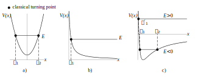

# Calcular en vez de medir

**Español** · [English](computing_instead_of_measuring.md)

Casi todas las figuras de un libro de física se **dibujan**: alguien decide dónde va cada
curva y cada marca, y el resultado se parece a lo que la física dice. Este documento trata
de las otras — las que se **calculan**, donde la geometría sale de las fórmulas y nadie
coloca nada a ojo.

MetaGráfica no es una herramienta de análisis de datos y no pretende serlo. La frontera es
deliberada y vale la pena decirla de entrada: **MG calcula la geometría de una ilustración a
partir de su modelo.** No reduce datos. Pero **el paquete trae los puentes**. Cuando los
datos vienen de una hoja de cálculo o de un archivo de medidas, `tools/hist2mg.py` los lee
con pandas, calcula los intervalos y las estadísticas que la figura va a necesitar, y
escribe un `.mg` que se incluye directamente. Y si tienes figuras antiguas hechas con
versiones anteriores de MG, `tools/mg1to2.py` traduce esas figuras a la sintaxis actual.

La división es la que uno querría: **reducir es un paso, dibujar es otro**, y cada uno se
puede rehacer sin tocar el otro. Si mañana llegan más mediciones, se vuelve a correr el
puente y la figura se regenera sin que haya que reabrirla.

Lo que sí ocurre dentro es el otro caso, y es el que este documento defiende: cuando la
figura tiene un **modelo** detrás —un potencial, una condición de cuantización, un punto de
retorno—, ese modelo puede vivir *en el archivo de la figura* en vez de en la cabeza del
autor o en un script que se pierde.

---

## El caso más simple: una parábola no es un arco

Antes de los potenciales y las funciones de onda, el ejemplo que todo el mundo conoce. Un
proyectil describe una **parábola**: `y = y₀ − k(x−x₀)²`. Dibujada a mano, uno traza un arco
que *se parece* a una trayectoria — y a mano, el arco más cómodo es el de un círculo.

No son la misma curva, y no por poco de principio: son **familias distintas**. Abajo, las dos
con el mismo lanzamiento, la misma llegada y la misma dirección de salida (tangente
horizontal) — el arco de círculo **más favorable** que se puede dibujar. Aun así divergen: la
parábola (negra) cae por dentro, el arco (gris) se abomba por fuera, hasta media unidad de
separación en un vano de nueve.



La figura de referencia que inspiró [`examples/tiro_parabolico.mg`](../examples/tiro_parabolico.mg)
dibujaba justamente ese arco. La nuestra calcula `y ∝ x²`, y medido —`k = (y₀−y)/(x−x₀)²`
sale **constante** en todos sus puntos— es una parábola exacta. **Ilustrar y calcular no
producen la misma figura, y solo la calculada es correcta.** Lo que sigue es el mismo
principio donde las apuestas suben: la física cuántica de un libro de texto.

---

## 1. Una figura con parámetros: Franck-Condon

[`examples/franck_condon.mg`](../examples/franck_condon.mg) dibuja dos potenciales de Morse
con sus niveles vibracionales y sus funciones de onda. **Nada en él está medido.** Se dan
cinco números por estado electrónico y el resto es forma cerrada:

```octave
a1  = 1.8            % alcance del potencial
re1 = 1.15           % distancia de equilibrio
we1 = 0.56           % frecuencia vibracional
xe1 = 0.028          % anarmonicidad
D1  = we1/(4*xe1)    % profundidad — NO es libre, ver §4
```

De ahí salen, sin que nadie las coloque:

| lo que se dibuja | de dónde sale |
|---|---|
| la curva | `V(r) = D(1 − exp(−a(r−re)))²` |
| los niveles | `E_v = we(v+½) − we·xe(v+½)²` |
| dónde empieza y acaba cada onda | `r± = re − ln(1 ∓ √(E/D))/a` (los puntos de retorno) |
| cuántos niveles ligados hay | `vmax = 1/(2·xe) − ½` |
| la amplitud de cada lóbulo | envolvente semiclásica WKB, `∝ (E−V)^(−¼)` |
| cuánto penetra la onda en la región prohibida | escala de Airy, `∝ |V′(retorno)|^(−⅓)` |

Así se dibuja un nivel vibracional:

```octave
E = we1*(v+0.5) - we1*xe1*(v+0.5)*(v+0.5)
s = sqrt(E/D1)
polyline { (re1 - ln(1+s)/a1)  (E)   (re1 - ln(1-s)/a1)  (E) }
```

La línea se traza **entre sus propios puntos de retorno**, calculados en el mismo renglón a
partir de la energía. Sus extremos no son coordenadas: son la forma cerrada.

**La prueba es cambiar un número.** Basta mover uno solo —la anarmonicidad `xe1`, de
`0.028` a `0.045`— para que la figura entera se reacomode de forma coherente: el pozo se
hace menos profundo (`D` pasa de 5.0 a 3.1), la línea de disociación baja con él, los
niveles se separan y se apiñan antes, y las ondas se reajustan a sus nuevos puntos de
retorno. La anarmonicidad también decide **cuántos estados ligados admite el potencial**: el
último pasa de v = 17 a v = 10, porque `vmax = 1/(2·xe) − ½`.

| `xe1 = 0.028` | `xe1 = 0.045` |
|:---:|:---:|
|  |  |

Las dos imágenes salen del **mismo archivo**; entre una y otra se cambió un carácter.

Ninguna de esas consecuencias está escrita en el archivo. Están escritas las **fórmulas**, y
la figura es lo que se deduce de ellas.

**El detalle que mejor resume la idea:** la transición vertical de Franck-Condon —la que
le da nombre al principio— aterriza en el nivel v′≈6 del estado excitado **sin que nadie la
ponga ahí**. Sale del desplazamiento entre las distancias de equilibrio de los dos estados
(`re1 = 1.15` frente a `re2 = 1.48`). Si acercas los dos pozos, la transición se mueve sola
al nivel que le toca. Eso es el principio de Franck-Condon *ocurriendo* en la figura, no
ilustrado en ella.

---

## 2. La física ata las manos, y esa es la ventaja

[`examples/turning_points.mg`](../examples/turning_points.mg) es un pozo con tres energías:
un estado ligado y dos no ligados. Se dan las asíntotas del potencial, su mínimo, los tres
puntos de retorno, las tres energías y el número de nodos del estado ligado; de ahí salen
`V(x)`, las longitudes de onda, las amplitudes y las colas.

Dos cosas que solo pasan cuando se calcula:

**La curva pasa por los puntos de retorno por construcción, no por ajuste.** La forma
`V(x) = V∞ − (V∞−Vm)·exp(−|(x−xm)/w|^s)` tiene dos parámetros libres de cada lado, y hay
exactamente dos condiciones que imponerles (que la curva valga `E_b` en un retorno y `E_c`
en el otro). Se despejan. No se ajustan: se resuelven. Los retornos rotulados caen sobre la
curva porque no pueden caer en otro sitio.

**Las tres ondas no son independientes.** La constante de fase sale de la condición de
cuantización de Bohr-Sommerfeld aplicada a la onda del estado ligado. Una vez fijada, las
otras dos **no tienen ninguna libertad**: es la misma partícula, así que es la misma
constante. Cambiar el número de nodos del estado ligado de 3 a 4 arrastra a las tres —la
ligada pasa de 3 a 4 lóbulos, y las otras dos de 23 a 30 y de 13 a 16— sin tocar nada más.

Toda esa dependencia cabe en un renglón — el que fija la constante de fase a partir de la
acción acumulada `Sq`:

```octave
C = (nodos+0.5)*pi/Sq
```

| `nodos = 3` | `nodos = 4` |
|:---:|:---:|
|  |  |

Se pidió un nodo más **en la onda de abajo**, y las tres se densificaron. Eso no es un
efecto secundario: es la misma partícula, y la condición de cuantización no admite otra
cosa.

Dibujando a mano, cada una de esas ondas es una decisión estética independiente. Aquí es una
consecuencia, y por eso no pueden desmentirse entre sí.

**Por eso este ejemplo no es un port fiel de la figura publicada.** Aquella se dibujó a
mano, como correspondía a las herramientas de su momento y al propósito de la figura, que es
ilustrar un concepto: la longitud de onda se eligió por regiones, buscando que cada tramo se
leyera con claridad. Escribirla en forma derivada renuncia a esa libertad —una sola
constante gobierna las tres ondas—, y por eso las dos versiones no coinciden: donde la onda
ligada tiene 4 antinodos, la cuantización pide del orden de 24 y 13 lóbulos para las otras
dos, más de los que el dibujo lleva. Reproducir el trazo y calcularlo eran objetivos
distintos; aquí se eligió calcularlo, y por eso el ejemplo tomó nombre de la física
(`turning_points`) en vez de número de figura.

---

## 3. Calcular encuentra cosas que medir no

[`examples/fig4-4.mg`](../examples/fig4-4.mg) reproduce tres potenciales: el oscilador
armónico, el coulombiano y el efectivo con barrera centrífuga.



En la versión original esas tres curvas estaban **digitalizadas**: 69 puntos cada una,
medidos sobre un dibujo. Al portarlas resultó que los puntos ajustan a formas analíticas
exactas —`V = x²`, `V = 1/r`, `V = 1/(2r²) − 1/r`— con un error del orden de `1e-6`. O sea:
las curvas *siempre fueron* esas fórmulas; lo que se había conservado era una copia
degradada, con 69 números en lugar de una línea.

La curva del oscilador, entera, es esto:

```octave
for i = 0 to n-1 {
    p = -0.92 + i*(1.84/n)
    q = -0.92 + (i+1)*(1.84/n)
    polyline { p  p*p   q  q*q }
}
```

El `p*p` es `V = x²`. Eso sustituyó a los 69 puntos.

Al reconstruirlas apareció además un detalle que la reproducción fiel no habría mostrado. El
archivo original colocaba una de las marcas con `DOT 5 011 .3` —un punto decimal
traspapelado que la manda a `x = 454`, fuera del lienzo—, así que esa marca nunca llegó a
dibujarse. Es una minucia: la figura se lee igual de bien sin ella, y precisamente por eso
podía quedarse así indefinidamente. Una marca ausente no deja rastro.

Lo que interesa no es el desliz, sino lo que hace falta para verlo. Al derivar las
posiciones de la física, el archivo **sabe qué marcas debería haber**, y una que no aparece
se vuelve detectable. Es una comprobación que solo existe cuando la figura se calcula, y es
la clase de red que MG pone hoy bajo el autor: los ejemplos del corpus se recompilan y se
comparan en cada cambio, así que un desliz de ese tipo tiene dónde saltar.

---

## 4. El compilador entiende de física más de lo que parece

El caso que más dice sobre todo esto es un error que se cometió escribiendo
`franck_condon.mg`.

La profundidad del pozo de Morse **no es un parámetro independiente**: la relación `D =
we/(4·xe)` la fija a partir de la frecuencia vibracional y la anarmonicidad, que son las dos
cantidades que se miden en un espectro. Al principio se dio `D` por separado, como si fuera
libre.

El resultado no fue una figura fea. Fue un **error de compilación**:

```
Error de evaluación: ln requiere argumento positivo
```

Con una `D` inconsistente, algunos niveles quedan por encima de la energía de disociación, y
entonces el punto de retorno externo `r₊ = re − ln(1 − √(E/D))/a` deja de existir: el
argumento del logaritmo se vuelve negativo. La física se volvió aritmética imposible, y el
compilador lo dijo y se detuvo.

Un programa de dibujo habría producido una figura perfectamente presentable con niveles
flotando sobre la disociación. Y esa es, además, la razón más fuerte por la que en MG un
error de evaluación es **fatal** y no un aviso: un documento inconsistente no debe producir
salida.

---

## Qué gana la figura con esto

- **La derivación viaja con el dibujo.** No hay un script aparte que calculó los números y
  se perdió, ni una imagen cuyo origen haya que reconstruir. El archivo *es* el argumento.
- **Se puede volver a preguntar.** «¿Y si la anarmonicidad fuera mayor?» se responde
  cambiando un número y recompilando, no rehaciendo la figura.
- **Las partes no pueden desmentirse entre sí.** Si los niveles, los retornos y las ondas
  salen todos de los mismos parámetros, no hay forma de que uno diga una cosa y otro la
  contraria — que es el modo típico de fallar de una figura dibujada por partes.
- **Los errores se vuelven detectables.** Sea un decimal perdido o una relación de Morse
  ignorada: lo que está derivado se puede contradecir, y contradecirse es lo que hace que
  un error salte.
- **Es texto.** Se guarda en un control de versiones como el manuscrito del artículo, se
  ve exactamente qué cambió entre dos versiones y quién lo cambió, y se regenera dentro de
  veinte años sin depender de que siga existiendo el programa con el que se dibujó.

Nada de esto exige que todas las figuras se hagan así. El corpus de MG tiene ports fieles,
figuras esquemáticas y diagramas donde no hay ningún modelo que calcular, y están bien como
están. Pero cuando **sí** hay un modelo detrás, dejarlo escrito cuesta lo mismo que
esconderlo.
